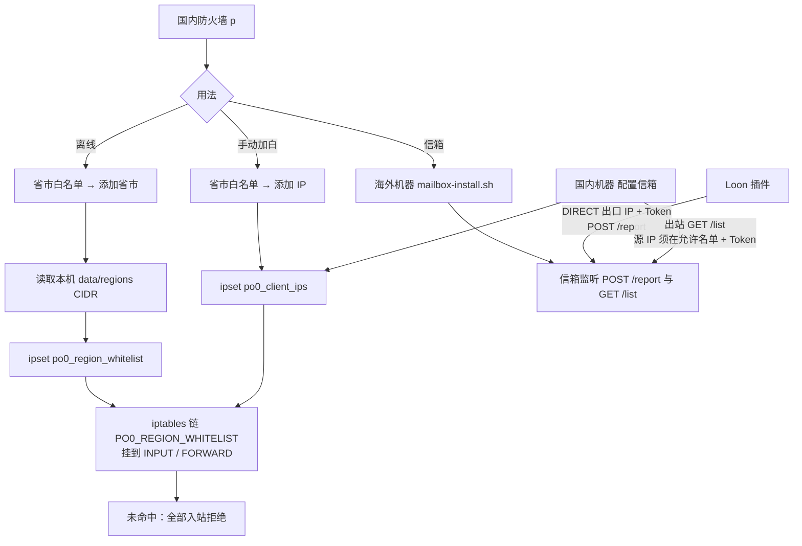

# po0 省/市白名单

## 免责声明

本项目仅供学习、测试与技术分享，不提供任何担保。

防火墙、白名单、入站限制可能违反云厂商或机房的服务条款，存在封禁、停机、扣款等风险。是否使用、如何使用，由你自行判断并承担全部后果。作者不对账号封禁、业务中断、数据损失或第三方索赔负责，也不受理因此产生的追责。

继续使用即视为已阅读并接受以上内容。

在国内服务器上按中国地区 CIDR 限制入站：命中选中省市，或命中客户端 IP，才放行；其余来源访问任意端口都会被拒绝。规则同时挂在 `INPUT` 和 `FORWARD`。

省市数据全部在本机 `data/regions/`，**不依赖信箱**。信箱只用来给手机直连出口 IP 加白，可选。

国内防火墙机器**不要开 HTTP 上报口**。需要手机 IP 时：Loon 报到**海外信箱**，国内机器只出站拉取。

## 原理



要点：

- **离线**：只选省市。本机 CIDR → `po0_region_whitelist` → 防火墙链。不联网也能应用。
- **手动 IP**：写入 `po0_client_ips`。链已挂上时立即生效，不必配信箱。
- **信箱**：Loon 把手机 DIRECT 出口 IP `POST /report` 到海外；国内机器定时 `GET /list` 拉回，写入 `po0_client_ips`。国内不开监听口。
- **应用**：必须先「添加省市」挂上链，客户端 IP 才会真正放行。未配信箱时不会安装拉取定时器。

## 安装

国内机器建议先离开安装目录，再覆盖：

```bash
cd /
curl -fsSL https://gh-proxy.com/https://raw.githubusercontent.com/rollingshmily/po0_whitelist/main/bootstrap.sh | sudo bash
```

装完输入 `p` 进入菜单。加速源默认 `gh-proxy.com`。

海外信箱（可选）在能被手机直连、也能被国内机器访问的机器上：

```bash
curl -fsSL https://gh-proxy.com/https://github.com/rollingshmily/po0_whitelist/archive/refs/heads/main.tar.gz -o /tmp/po0.tar.gz
tar -xzf /tmp/po0.tar.gz -C /tmp
cd /tmp/po0_whitelist-main
sudo bash mailbox-install.sh
```

会询问：

1. 监听端口（默认 `18443`）
2. **允许拉取的源 IP**：国内防火墙访问信箱时的源地址（内网就填内网 IP，逗号/空格均可）

装完打印 Loon 要填的地址、端口、Token。Token 只留在信箱机器，不要提交到 Git。卸载：`sudo bash mailbox-install.sh uninstall`。

本地已有目录时：

```bash
sudo bash install.sh setup
```

## 用法

### 离线省市白名单

1. 国内机器执行 bootstrap
2. `p` → `1) 省市白名单` → `1) 添加省市`
3. 选省，再选全省或若干城市（编号或名称，空格/逗号分隔）
4. 确认 `YES`。未命中白名单的入站会被拒绝

之后：

- `2) 应用上次选择`：不重选，按上次省市再应用
- `3) 当前规则`：查看 ipset / iptables
- `4) 清除省市`：去掉省市段，客户端 IP 保留
- `5) 清除全部`：省市段和客户端 IP 一起清
- `6) 添加 IP`：手动加一个 IPv4

### 信箱 + Loon（可选）

1. 海外机器安装信箱
2. 国内 `p` → `2) 信箱` → `1) 配置信箱`（地址、端口、Token、拉取间隔，默认 5 分钟）
3. 先「添加省市」挂上防火墙链
4. 手机导入 Loon 插件，填写信箱地址/端口/Token；给**信箱公网 IP** 配 DIRECT
5. Loon 定时或网络变化时上报；国内机器按间隔出站拉取

## 菜单

```
po0 白名单
 1) 省市白名单
 2) 信箱
 3) 更新
 4) 卸载
 0) 退出
```

```
省市白名单
 1) 添加省市
 2) 应用上次选择
 3) 当前规则
 4) 清除省市
 5) 清除全部
 6) 添加 IP
 0) 返回
```

```
信箱
 1) 配置信箱
 2) 拉取间隔
 3) 立即拉取
 4) 客户端列表
 5) 查看 Token
 0) 返回
```

`3) 更新`：用加速源覆盖 `/opt/po0_whitelist`，有上次省市则自动再应用。

## 命令

`p` 与 `install.sh` 等价，下列均可：

| 命令 | 作用 |
|------|------|
| `p` | 菜单 |
| `p apply` | 添加省市并应用 |
| `p reapply` | 应用上次选择 |
| `p status` | 当前规则 |
| `p clear` | 清除省市（保留客户端 IP） |
| `p clear-all` | 清除全部 |
| `p add-ip` | 手动添加 IPv4 |
| `p update` | 更新脚本和 IP 库，并按上次选择应用 |
| `p mailbox-config` | 配置信箱 |
| `p pull-interval` | 修改拉取间隔（分钟，如 `3` 即 3 分钟） |
| `p pull` | 立即从信箱拉取 |
| `p clients` | 客户端 IP 列表 |
| `p token` | 显示信箱地址与 Token |
| `p uninstall` | 卸载本机脚本、快捷命令、拉取定时器 |
| `p dry-run` | 只打印将执行的命令 |
| `p help` | 命令说明 |

## Loon 插件

先删旧插件，再导入：

```text
https://gh-proxy.com/https://raw.githubusercontent.com/rollingshmily/po0_whitelist/main/loon/po0-ip-report.plugin
```

备用：

```text
https://cdn.jsdelivr.net/gh/rollingshmily/po0_whitelist@main/loon/po0-ip-report.plugin
```

插件里填写：

- 信箱地址：海外机器公网 IP（不要填国内防火墙公网 IP）
- 信箱端口：与 `mailbox-install.sh` 一致
- Token：信箱安装时打印的那把
- 定时检查：Cron，默认 `*/5 * * * *`

信箱 IP 必须 Loon DIRECT。上报路径为 `POST /report`；国内拉取为 `GET /list`。

## 安全

`apply` 会拒绝所有未命中的入站，包括 SSH。脚本会检测当前 SSH 客户端 IP，询问是否临时加入本次白名单，建议保留默认 `Y`。

省市应用不访问外网。缺少 `iptables` / `ipset` 时用系统软件源安装。

## 文件

- `install.sh`：国内防火墙入口（快捷命令 `p`）
- `bootstrap.sh`：国内一键安装
- `mailbox-install.sh`：海外信箱安装
- `data/regions.json`、`data/regions/*.txt`：省市 CIDR
- `tools/mailbox_server.py`：信箱服务
- `loon/`：Loon 插件
- `vendor/ipipfree.ipdb`：离线 ipdb 参考

## 重新准备本地数据

在有外网的机器上：

```bash
python tools/prepare_data.py --ipdb /path/to/ipipfree.ipdb
```

再把目录复制到防火墙机器。
